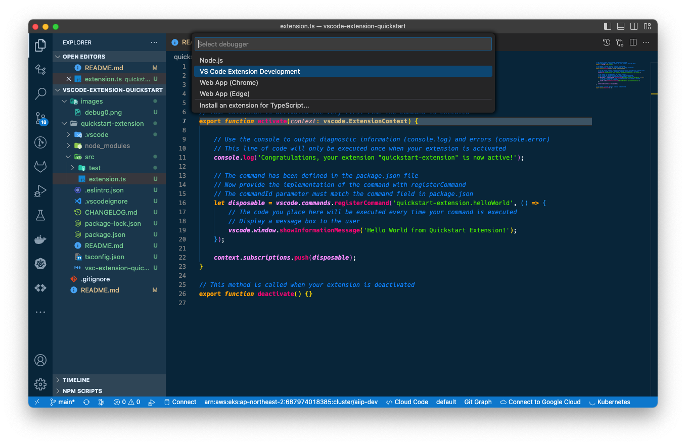

# Quickstart: Vscode Extension

See: https://code.visualstudio.com/api/get-started/your-first-extension

## Pre-requisite

* git
* javascript
* typescript
* node.js(+npm)
* yeoman

### Install `node.js` with `nvm`

#### Install `nvm`(Node Version Manager)

[Git Link](https://github.com/nvm-sh/nvm#installing-and-updating)

* ubuntu
```shell
& sudo apt update && \
    sudo apt install build-essential libssl-dev && \
    curl -o- https://raw.githubusercontent.com/nvm-sh/nvm/v0.39.3/install.sh | bash
```

* RHEL

```shell
sudo yum update && \
    sudo yum install gcc gcc-c++ openssl-devel && \
    curl -o- https://raw.githubusercontent.com/nvm-sh/nvm/v0.39.3/install.sh | bash
```

* Mac

```shell
    curl -o- https://raw.githubusercontent.com/nvm-sh/nvm/v0.39.3/install.sh | bash
```

or

```shell
brew update && \
    brew install nvm
```

Then,

```console
  % Total    % Received % Xferd  Average Speed   Time    Time     Time  Current
                                 Dload  Upload   Total   Spent    Left  Speed
100 15916  100 15916    0     0  39392      0 --:--:-- --:--:-- --:--:-- 41233
=> nvm is already installed in <$HOME>/.nvm, trying to update using git
=> => Compressing and cleaning up git repository

=> nvm source string already in <$HOME>/.zshrc
=> bash_completion source string already in <$HOME>/.zshrc
=> Close and reopen your terminal to start using nvm or run the following to use it now:

export NVM_DIR="$HOME/.nvm"
[ -s "$NVM_DIR/nvm.sh" ] && \. "$NVM_DIR/nvm.sh"  # This loads nvm
[ -s "$NVM_DIR/bash_completion" ] && \. "$NVM_DIR/bash_completion"  # This loads nvm bash_completion
```

Add source commands to your __profile rcfile__(`~/.bashrc`, `~/.zshrc`, `~/.profile`, `~/.bash_profile`, etc.).

```shell
export NVM_DIR="$HOME/.nvm"
[ -s "$NVM_DIR/nvm.sh" ] && \. "$NVM_DIR/nvm.sh"  # This loads nvm
[ -s "$NVM_DIR/bash_completion" ] && \. "$NVM_DIR/bash_completion"  # This loads nvm 
```

Reopen the console and run:

```shell
nvm --version
```

#### Install `node`

```shell
# node: latest
nvm install node

# node: a specific version
nvm install 18.16.0 # 16.20.0

# show available versions
nvm ls-remote
```

#### Select a specific version of `node`

[node.js versions](https://nodejs.org/en/download/releases)

```shell
# latest
nvm use node

# 18.x
nvm use 18

# a specific version
nvm use 18.16.0 # 16.20.0 # 16.13.0

# check current node version
node -v
```

### Install `npm`

If you're using `nvm`, `npm` already has been installed.

```shell
which npm
npm -v
```

### Install `yeoman`

```shell
npm install -g yo
```

## Setup

```shell
npm install -g yo generator-code
```

* `packages-lock.json`
* `package.json`
* `node_modules`


```shell
$ yo code

     _-----_     ╭──────────────────────────╮
    |       |    │   Welcome to the Visual  │
    |--(o)--|    │   Studio Code Extension  │
   `---------´   │        generator!        │
    ( _´U`_ )    ╰──────────────────────────╯
    /___A___\   /
     |  ~  |     
   __'.___.'__   
 ´   `  |° ´ Y ` 

? What type of extension do you want to create? (Use arrow keys)
❯ New Extension (TypeScript) 
  New Extension (JavaScript) 
  New Color Theme 
  New Language Support 
  New Code Snippets 
  New Keymap 
  New Extension Pack 
  New Language Pack (Localization) 
  New Web Extension (TypeScript) 
  New Notebook Renderer (TypeScript)

? What's the name of your extension? Quickstart Extension
? What's the identifier of your extension? quickstart-extension
? What's the description of your extension? It's an example
? Initialize a git repository? n
? Bundle the source code with webpack? n
? Which package manager to use? (Use arrow keys)
❯ npm 
  yarn 
  pnpm 

Writing in <$HOME>/git/vscode-extension-quickstart/quickstart-extension...
   create quickstart-extension/.vscode/extensions.json
   create quickstart-extension/.vscode/launch.json
   create quickstart-extension/.vscode/settings.json
   create quickstart-extension/.vscode/tasks.json
   create quickstart-extension/package.json
   create quickstart-extension/tsconfig.json
   create quickstart-extension/.vscodeignore
   create quickstart-extension/vsc-extension-quickstart.md
   create quickstart-extension/README.md
   create quickstart-extension/CHANGELOG.md
   create quickstart-extension/src/extension.ts
   create quickstart-extension/src/test/runTest.ts
   create quickstart-extension/src/test/suite/extension.test.ts
   create quickstart-extension/src/test/suite/index.ts
   create quickstart-extension/.eslintrc.json

Changes to package.json were detected.

Running npm install for you to install the required dependencies.
```

[Github URL](https://github.com/microsoft/vscode-extension-samples/tree/main/helloworld-sample)

### Change the directory

Your extension repository has been created as named `quickstart-extension`(identifier name).
You have two choices.

Option 1. Reopen VSCode Window at `quickstart-extension`, which is a new `${workspaceFolder}`.
Option 2. Copy contents in `quickstart-extension` into `.`.

We choose Option 1.

```shell
cp -rf ./quickstart-extension/* ./
rm -rf ./quickstart-extension
```

## Build

### Debug your Extension

* Press `F5`(default Debug keyboard shortcut)
* Select `VS Code Extension Development`




```shell

```

### Modify your Extension

* [Manifest](https://code.visualstudio.com/api/references/extension-manifest)
* [VSCode API](https://code.visualstudio.com/api/references/vscode-api)
* [Built-in Commands](https://code.visualstudio.com/api/references/commands)
* [Contribution Points](https://code.visualstudio.com/api/references/contribution-points)
